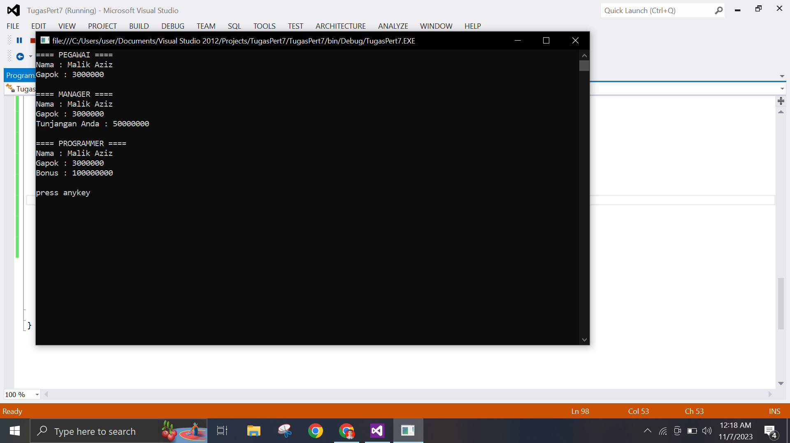

# tugasoop 6-7 Inherit<br>

# nama : Malik Aziz

# Nim : 312210130

# kelas : TI.22.BI <br>

- Implementasi code dalam C#<br>

```
using System;
using System.Collections.Generic;
using System.Linq;
using System.Text;
using System.Threading.Tasks;

namespace TugasPert7
{
    public class Pegawai
    {


        private string nama;
        private double gajiPokok;

        public void setNama(string nama)
        {
            this.nama = nama;
        }
        public string getNama() { return this.nama; }

        public double getGajiPokok() { return this.gajiPokok; }

        public void setGajiPokok(double gajiPokok) { this.gajiPokok = gajiPokok; }

        public void cetakinfo()
        {

            Console.WriteLine("Nama : " + this.nama);
            Console.WriteLine("Gapok : " + this.gajiPokok);
        }
    }


    public class manager : Pegawai
    {

        private double tunjangan;

        public void setTunjangan(double tunjangan){this.tunjangan = tunjangan;}
        public double getTunjangan(){return this.tunjangan;}

        public new void cetakinfo()
        {

            base.cetakinfo();
            this.cetakTunjangan();
        }
        public void cetakTunjangan()
        {
            Console.WriteLine("Tunjangan Anda : " + this.tunjangan);

        }
    }

    public class Programmer : Pegawai
    {
        private double bonus;


        public void setBonus(double bonus) { this.bonus = bonus; }

        public double getBonus() { return this.bonus; }

        public new void cetakinfo()
        {
            base.cetakinfo();
            this.cetakBonus();
        }
        public void cetakBonus()
        {
            Console.WriteLine("Bonus : " + this.bonus);


        }

    }
    class program
    {
        static void Main(string[] args)
        {
            Console.WriteLine("==== PEGAWAI ====");
            Pegawai pegawai = new Pegawai();
            pegawai.setNama("Malik Aziz");
            pegawai.setGajiPokok(3000000);
            pegawai.cetakinfo();
            Console.WriteLine();

            Console.WriteLine("==== MANAGER ====");
            manager Manager = new manager();
            Manager.setNama("Malik Aziz");
            Manager.setGajiPokok(3000000);
            Manager.setTunjangan(50000000);
            Manager.cetakinfo();
            Console.WriteLine();

            Console.WriteLine("==== PROGRAMMER ====");
            Programmer programer = new Programmer();
            programer.setNama("Malik Aziz");
            programer.setGajiPokok(3000000);
            programer.setBonus(100000000);
            programer.cetakinfo();
            Console.WriteLine();


            Console.WriteLine("press anykey");
            Console.ReadKey();
        }
    }
}

```

- Hasil

  
